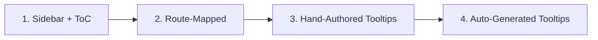

# pict-section-inlinedocumentation

> Embed context-aware documentation and tooltip help directly inside any Pict application.

A Pict section that turns a folder of Markdown files into in-app help. Ships four progressively deeper embedding modes: a drop-in sidebar with a table of contents, route-mapped reading panes, hand-authored tooltips on specific controls, and auto-generated tooltips for every Manyfest-managed control in your app — editable live when a content owner is signed in.

Part of the [Retold](https://github.com/stevenvelozo/retold) suite.

## Install

```bash
npm install pict-section-inlinedocumentation
```

## Quick Usage

```js
const libPict = require('pict');
const libInlineDocs = require('pict-section-inlinedocumentation');

const _Pict = new libPict({ Product: 'My App', Version: '1.0.0' });

_Pict.addSection('InlineDocumentation', libInlineDocs,
{
    DocumentationRoot: '/docs/',
    CatalogURL: '/docs/retold-catalog.json',
    DefaultTopic: 'overview',
    SidebarContainer: '#AppHelpSidebar'
});

_Pict.onAfterInitializeAsync = async () =>
{
    await _Pict.views.InlineDocumentation.renderAsync();
};
```

Add a container to your HTML and you're done:

```html
<aside id="AppHelpSidebar"></aside>
```

## Four Levels of Embeddedness



| Level | What you get | Effort |
|---|---|---|
| 1 | Sidebar with a ToC of every topic | A few lines of config |
| 2 | Help pane tracks the current route | Add a route map |
| 3 | Tooltips on specific controls | `data-help` per control |
| 4 | Tooltips on **every** Manyfest control, editable in-app | One call per form |

Each level is a strict superset of the one below it.

## Highlights

- Built on `pict-view`, integrates with `pict-router`
- Consumes `retold-catalog.json` + `retold-keyword-index.json` from `pict-docuserve`
- Safe Markdown renderer with Mermaid, code highlighting, and KaTeX
- MutationObserver keeps tooltips bound as the DOM changes
- Edit mode: content editors can rewrite topics from the running app and POST them back
- Emits lifecycle events for analytics and audit

## Scripts

| Script | What it does |
|---|---|
| `npm test` | Run Mocha TDD test suite |
| `npm run coverage` | Code coverage via nyc/Istanbul |
| `npx quack build` | Build the browser bundle |

## Documentation

Full documentation lives in [`docs/`](./docs/) and is published via [pict-docuserve](https://github.com/stevenvelozo/pict-docuserve):

- [Overview](./docs/overview.md)
- [Quickstart](./docs/quickstart.md)
- [Architecture](./docs/architecture.md)
- [Implementation Reference](./docs/reference.md)
- [API Reference](./docs/api-reference.md)
- Embedding: [Level 1](./docs/embedding-level1-sidebar.md) · [Level 2](./docs/embedding-level2-routes.md) · [Level 3](./docs/embedding-level3-tooltips.md) · [Level 4](./docs/embedding-level4-autogen.md)

Regenerate the catalog and keyword index after editing any Markdown file:

```bash
npx quack prepare-docs
```

## Relationship to Other Retold Modules

| Module | Role |
|---|---|
| [pict](https://github.com/stevenvelozo/pict) | Application framework |
| [pict-view](https://github.com/stevenvelozo/pict-view) | Base view class |
| [pict-router](https://github.com/stevenvelozo/pict-router) | Route change source for Level 2 |
| [pict-docuserve](https://github.com/stevenvelozo/pict-docuserve) | Catalog + keyword index producer |
| [manyfest](https://github.com/stevenvelozo/manyfest) | Descriptors walked for Level 4 |

## License

[MIT](./LICENSE) — same as the rest of the Retold suite.
