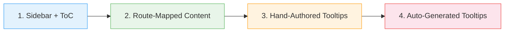

# pict-section-inlinedocumentation

> Embed context-aware documentation and tooltip help directly inside any Pict application.

`pict-section-inlinedocumentation` is a Pict section that turns a folder of Markdown topics into in-app help. It spans the full spectrum from "a sidebar with a table of contents" to "every editable control on every screen has a live, editable tooltip" -- and you pick the level that matches your product.

Part of the [Retold](https://github.com/stevenvelozo/retold) suite. Uses [`pict-view`](/pict/pict-view/) as its base, optionally consumes catalogs from [`pict-docuserve`](/pict/pict-docuserve/), and at the deepest level pairs with [`manyfest`](/utility/manyfest/) to auto-generate tooltips for every descriptor in your model.

## Four Levels of Embeddedness



Each level is a strict superset of the one before it.

## Documentation

Published with [`pict-docuserve`](/pict/pict-docuserve/). Open `docs/index.html` locally, or browse the source Markdown:

- **[Overview](overview.md)** -- what it does and why
- **[Quickstart](quickstart.md)** -- sidebar running in five minutes
- **[Architecture](architecture.md)** -- services, views, lifecycle, with a Mermaid diagram
- **[Implementation Reference](reference.md)** -- source tree tour
- **[API Reference](api-reference.md)** -- every exposed function with a runnable snippet

### Embedding Guides

- **[Level 1 -- Sidebar + ToC](embedding-level1-sidebar.md)** -- least embedded
- **[Level 2 -- Route-Mapped Content](embedding-level2-routes.md)** -- more embedded
- **[Level 3 -- Hand-Authored Tooltips](embedding-level3-tooltips.md)** -- somewhat embedded
- **[Level 4 -- Auto-Generated Tooltips](embedding-level4-autogen.md)** -- most embedded

## Installation

```bash
npm install pict-section-inlinedocumentation
```

## Tiny Example

```js
const libPict = require('pict');
const libInlineDocs = require('pict-section-inlinedocumentation');

const _Pict = new libPict({ Product: 'My App', Version: '1.0.0' });

_Pict.addSection('InlineDocumentation', libInlineDocs,
{
    DocumentationRoot: '/docs/',
    CatalogURL: '/docs/retold-catalog.json',
    DefaultTopic: 'overview',
    SidebarContainer: '#AppHelpSidebar'
});

_Pict.onAfterInitializeAsync = async () =>
{
    await _Pict.views.InlineDocumentation.renderAsync();
};
```

## Relationship to Other Modules

| Module | Role |
|---|---|
| [pict](/pict/pict/) | Application framework |
| [pict-view](/pict/pict-view/) | Base view class |
| [pict-router](/pict/pict-router/) | Source of route change events for Level 2 |
| [pict-docuserve](/pict/pict-docuserve/) | Produces the catalog and keyword index consumed by this section |
| [pict-template-markdown](/pict/pict-template-markdown/) | Markdown -> HTML renderer |
| [manyfest](/utility/manyfest/) | Descriptors walked by Level 4 auto-generation |

## License

MIT -- same as the rest of the Retold suite.
