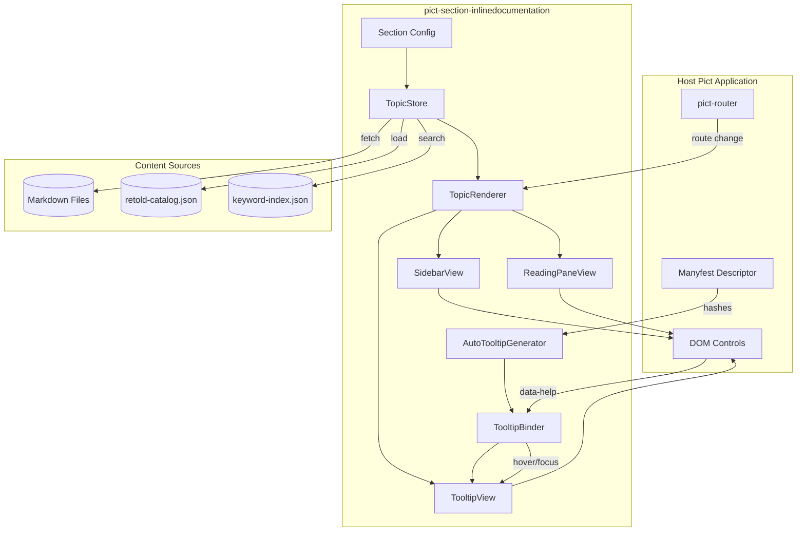

# Architecture

`pict-section-inlinedocumentation` is a Pict section that wraps three collaborating services: a **topic store**, a **renderer**, and a **binder**. The section itself is thin -- it owns configuration and lifecycle; the services do the work.

## Core Concepts

- **Topic** -- a single Markdown file with frontmatter. Addressed by a slash-separated key such as `records/editing` or `customers/email-field`.
- **Catalog** -- a JSON index of topics, either shipped with the app or produced by `pict-docuserve prepare-docs`.
- **Route Map** -- a list of `{ Pattern, Topic }` entries that associates application routes with topic keys.
- **Binding** -- a runtime link between a DOM element and a topic, expressed via `data-help="<key>"` or via a Manyfest hash.

## Component Diagram

## Services

### TopicStore

Owns the corpus. Responsible for:

- Fetching the catalog on boot (or walking a folder if no catalog is provided).
- Lazy-loading individual topic Markdown on demand, with an LRU cache.
- Resolving aliases and redirects declared in topic frontmatter.
- Providing a keyword search API when `retold-keyword-index.json` is present.

### TopicRenderer

Transforms topic Markdown into HTML and injects it into the reading pane or tooltip view. Supports:

- Frontmatter-driven title, category, and related-topic metadata.
- Mermaid, code-highlighting, and KaTeX passes (same as `pict-docuserve`).
- Template substitution for dynamic fields (e.g. the current entity name).

### TooltipBinder

Manages the relationship between DOM elements and topics. It observes the document for elements with `data-help` attributes, attaches hover/focus listeners, and shows a small popover tooltip driven by `TopicRenderer`. Uses the Pict MutationObserver wrapper so dynamically added elements get picked up automatically.

### AutoTooltipGenerator

Given a Manyfest descriptor, walks every hash in the descriptor and creates a synthetic topic key like `<manyfest-scope>/<hash>`. If a topic already exists, it is used as-is. If not, a stub is created in memory and -- in edit mode -- persisted back to the content service so an editor can fill it in from the running app.

## Lifecycle

1. **Bootstrap** -- The section registers with Pict and receives its config.
2. **Catalog load** -- `TopicStore` fetches the catalog (or enumerates files).
3. **Sidebar render** -- `SidebarView` renders the ToC from the catalog.
4. **Route hook** -- If a route map is configured, the section subscribes to `pict-router` change events and asks `TopicRenderer` to render the current topic.
5. **Tooltip binding** -- If `bindTooltipsAsync` has been called, every element in scope with `data-help` gets a tooltip.
6. **Auto-generation** -- If `autoGenerateTooltipsAsync` has been called, the Manyfest hashes are walked and bindings applied.

## Pict Content Assignment

The section honors the Pict `Pict-Content-Assignment` override pattern: rendering goes through the section's assigned content target, so it works in the browser, in blessed/terminal Pict apps via `pict-terminalui`, and in unit tests via `Pict-Environment-Log`.

## Security

- Markdown is rendered with a safe allowlist; script tags and `javascript:` URLs are stripped.
- Topic keys are validated against `^[a-z0-9][a-z0-9/-]*$` before being used as URL paths.
- The optional edit-mode persistence path requires an explicit `EditEndpoint` and a bearer token; it will refuse to POST without both.
